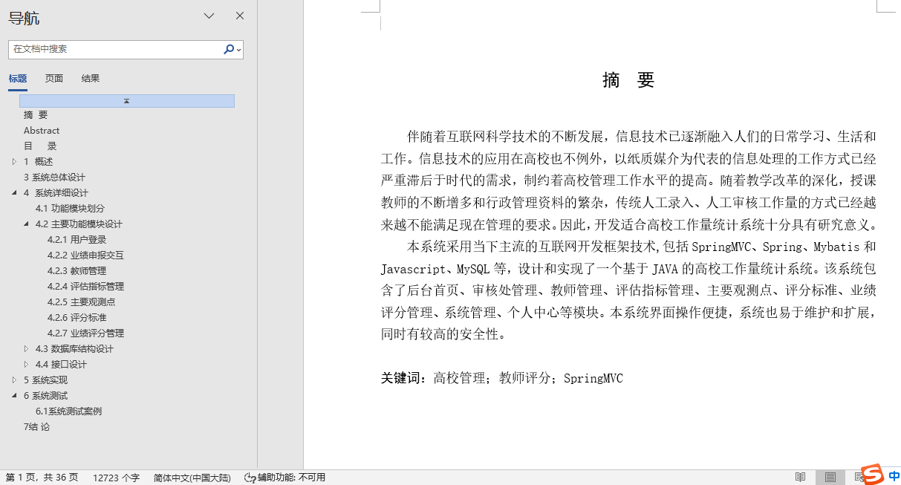
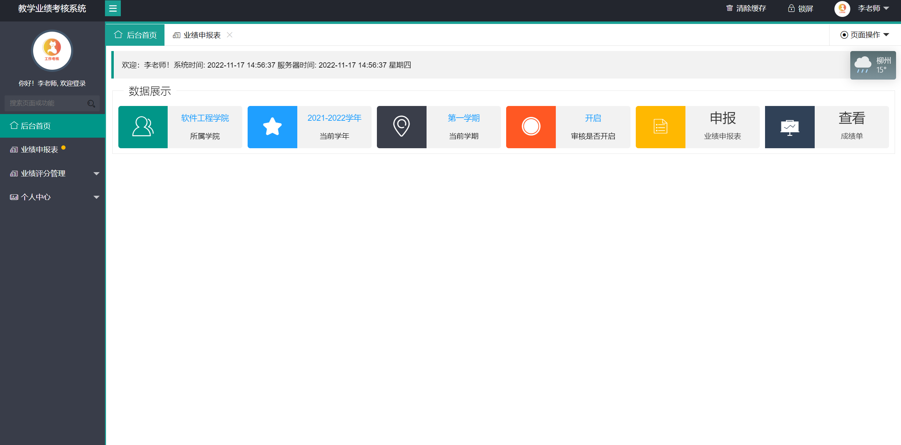
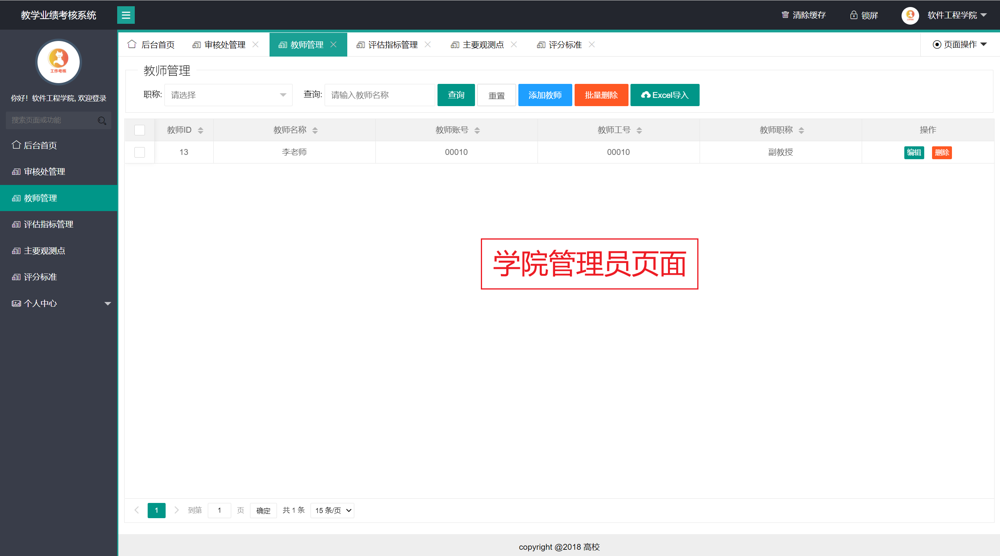
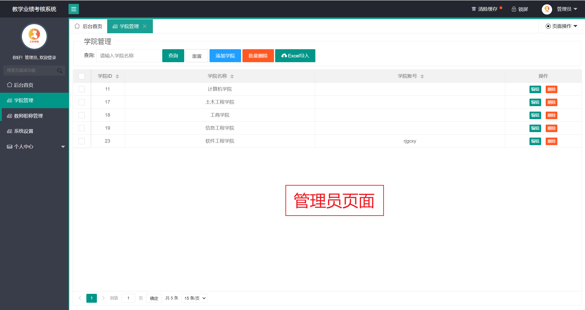
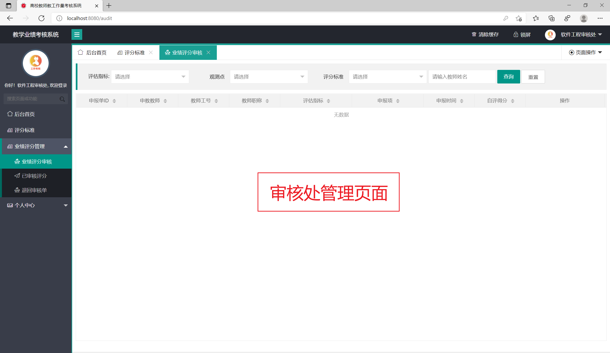
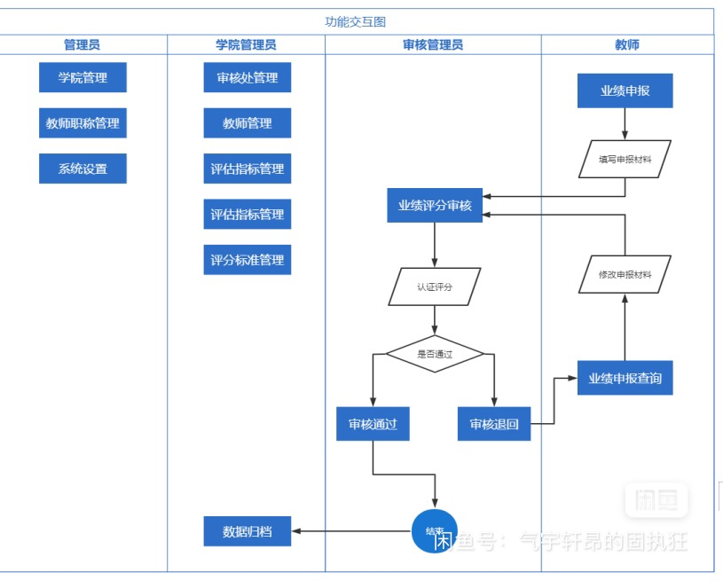
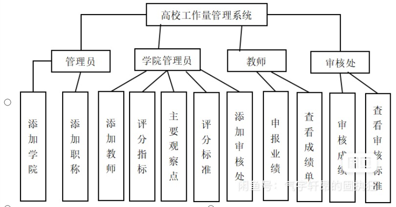
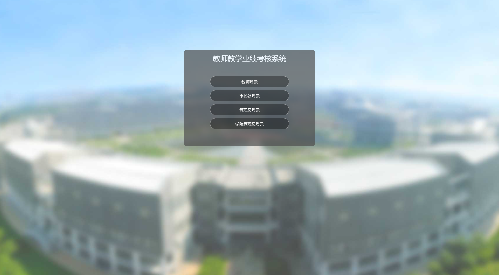

## 基于SSM的高校工作量统计系统(程序+报告)

- <b>完整代码获取地址：从戎源码网 ([https://armycodes.com/](https://armycodes.com/))</b>
- <b>技术探讨、资料分享，请加QQ群：692619798</b> 
- <b>作者微信：19941326836  QQ：952045282</b> 
- <b>承接计算机毕业设计、Java毕业设计、Python毕业设计、深度学习、机器学习</b>
- <b>选题+开题报告+任务书+程序定制+安装调试+论文+答辩ppt 一条龙服务</b>
- <b>所有选题地址 ([https://github.com/YuLin-Coder/AllProjectCatalog](https://github.com/YuLin-Coder/AllProjectCatalog)) </b>

## 项目介绍
基于SSM的高校工作量统计系统(教师教学业绩考核系统）。Javaee项目，SSM项目，
系统分为四个角色：老师、审核处、学院管理员、管理员
本系统采用当下主流的互联网开发框架技术,包括SpringMVC、Spring、Mybatis和Javascript、MySQL等，设计和实现了一个基于JAVA的高校工作量统计系统。该系统包含了后台首页、审核处管理、教师管理、评估指标管理、主要观测点、评分标准、业绩评分管理、系统管理、个人中心等模块。本系统界面操作便捷，系统也易于维护和扩展，同时有较高的安全性。

## 项目技术
- 编程语言：Java
- 数据库：MySQL
- 前端技术：JSP、JavaScript、JQuery
- 后端技术：Spring、SpringMVC、MyBatis

## 运行环境
- JDK版本：JDK1.8及以上
- 开发工具：IDEA、Ecplise、Myecplise都可以
- 数据库: MySQL5.7及以上
- Maven：maven3.0及以上

## 运行截图

